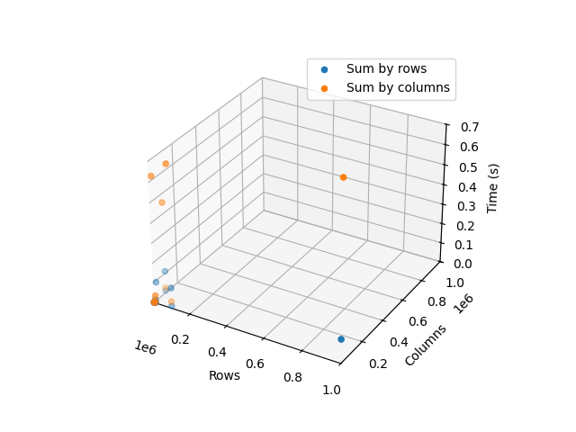

# Tarea 2 - CI3641 (Septiembre - Diciembre 2024)

**Hecho por**: Juan Cuevas _19-10056_

## Pregunta 1

### Enunciado

#### a) De una breve descripción del lenguaje escogido. 
  i. Diga qué tipos de datos posee y qué mecanismos ofrece para la creación de nuevos tipos (incluyendo tipos polimórficos de haberlos).

  ii. Describa el funcionamiento del sistema de tipos del lenguaje, incluyendo el tipo de equivalencia para sus tipos, reglas de compatibilidad y capacidades de inferencia de tipos. 

  iii. Diga si la totalidad de los tipos de datos del lenguaje conforman un álgebra. Diga si posse construcciones que corresponden a: el tipo producto, el tipo suma, el tipo cero (neutro de la suma) y el tipo uno (neutro del producto).

#### b) Implemente los siguientes programas en el lenguaje escogido: 
  i. Defina un tipo de datos recursivo que represente numerales de Church. A continuación un ejemplo en Haskell: 

    ```haskell
    data Church = Cero | Suc Church 
    ```

  Recuerde que un numeral de Church se construye a partir de: 
    - Un valor constante que representa al cero. 
    - Una función sucesor que, para cualquier número n, devuelve n + 1. Sobre este tipo se desea que implemente las funciones suma y multiplicación.
   
  _Nota: No busque implementaciones online, ya que la mayoría no hace lo que se pide. No de un valor funcional para Zero ni para Suc. Ambos deben ser constructores de tipos y nada más._

  ii. Defina un tipo que represente conjuntos de personas, donde cada persona tiene un nombre y una edad. Sobre este tipo, defina funciones que devuelvan: 
  - La cantidad de personas en el conjunto.
  - El subconjunto de personas que son mayores de edad (cuya edad es mayor o igual a 18). 
  - El nombre más común en el conjunto (si hay varios nombres con la máxima cantidad de ocurrencias, se puede tomar cualquiera de ellos).

### Respuesta

Lenguaje seleccionado: **Java**

#### a) De una breve descripción del lenguaje escogido.

##### i. Diga qué tipos de datos posee y qué mecanismos ofrece para la creación de nuevos tipos (incluyendo tipos polimórficos de haberlos).

Java es un lenguaje de programación de alto nivel, orientado a objetos, que fue creado por Sun Microsystems en 1995. Java es un lenguaje fuertemente tipado, lo que significa que todas las variables deben ser declaradas con un tipo específico. Java posee los siguientes tipos de datos:

- **Tipos primitivos**: Son los tipos de datos más básicos que se pueden utilizar en Java. Estos tipos de datos son: `byte`, `short`, `int`, `long`, `float`, `double`, `boolean`, y `char`.
- **Clases**: Java es un lenguaje orientado a objetos, por lo que las clases son una parte fundamental del lenguaje. Las clases permiten la creación de nuevos tipos de datos, y pueden contener atributos y métodos.
- **Interfaces**: Las interfaces en Java permiten la definición de métodos que deben ser implementados por las clases que las implementan. Las interfaces permiten la creación de tipos polimórficos en Java.
- **Tipos genéricos**: Java permite la definición de clases y métodos genéricos, que pueden trabajar con tipos de datos específicos. Los tipos genéricos permiten la creación de estructuras de datos y algoritmos que pueden ser utilizados con diferentes tipos de datos.
- **Enumeraciones**: Las enumeraciones en Java permiten la definición de un tipo de datos que puede tomar un conjunto fijo de valores. Las enumeraciones son útiles para representar conjuntos de constantes relacionadas.
- **Arrays**: Java permite la creación de arreglos de cualquier tipo de datos. Los arreglos en Java son objetos que pueden contener múltiples elementos del mismo tipo.
- **Tipos de datos compuestos**: Java permite la creación de tipos de datos compuestos, como clases, estructuras, y registros. Estos tipos de datos pueden contener múltiples atributos y métodos.
- **Tipos de datos abstractos**: Java permite la creación de tipos de datos abstractos, que pueden ocultar los detalles de implementación y proporcionar una interfaz clara para interactuar con los datos.
- **Tipos de datos recursivos**: Java permite la definición de tipos de datos recursivos, que pueden contener referencias a sí mismos. Los tipos de datos recursivos son útiles para representar estructuras de datos complejas, como árboles y listas enlazadas.
- **Tipos de datos polimórficos**: Java permite la creación de tipos de datos polimórficos, que pueden representar diferentes tipos de datos en función del contexto en el que se utilizan. Los tipos de datos polimórficos son útiles para escribir código genérico y reutilizable.

##### ii. Describa el funcionamiento del sistema de tipos del lenguaje, incluyendo el tipo de equivalencia para sus tipos, reglas de compatibilidad y capacidades de inferencia de tipos.

Java es un lenguaje de programación fuertemente tipado, lo que significa que todas las variables deben ser declaradas con un tipo específico. Java utiliza un sistema de tipos estático, lo que significa que los tipos de datos se verifican en tiempo de compilación para garantizar la corrección del programa. Java utiliza un sistema de tipos nominal, lo que significa que los tipos de datos se comparan por su nombre en lugar de por su estructura.

Java utiliza un sistema de tipos basado en clases y objetos, lo que significa que todos los tipos de datos en Java son clases u objetos. Java utiliza la herencia para organizar los tipos de datos en una jerarquía de clases, lo que permite la creación de subtipos y la reutilización de código.

Java utiliza reglas de compatibilidad para determinar si un tipo de datos es compatible con otro tipo de datos. Java utiliza la relación de subtipado para determinar la compatibilidad entre tipos de datos. Un tipo de datos es subtipo de otro tipo de datos si puede ser utilizado en lugar del otro tipo de datos en cualquier contexto en el que se espera el tipo de datos original.

Java utiliza la inferencia de tipos para determinar el tipo de datos de una expresión en función de su contexto. Java utiliza la inferencia de tipos para reducir la redundancia en la declaración de tipos y mejorar la legibilidad del código.

##### iii. Diga si la totalidad de los tipos de datos del lenguaje conforman un álgebra. Diga si posse construcciones que corresponden a: el tipo producto, el tipo suma, el tipo cero (neutro de la suma) y el tipo uno (neutro del producto).

Java no es un lenguaje funcional puro, por lo que no todos los tipos de datos en Java conforman un álgebra. Java no posee construcciones explícitas para el tipo producto, el tipo suma, el tipo cero, o el tipo uno. Sin embargo, Java permite la creación de tipos de datos compuestos, como clases y estructuras, que pueden representar de manera indirecta el tipo producto y el tipo suma.

#### b) Implemente los siguientes programas en el lenguaje escogido:

##### i. Defina un tipo de datos recursivo que represente numerales de Church.

Para ejecutar el programa, se puede usar el script `main.sh` que compila y ejecuta el programa en Java.

```bash
./main.sh exe1-b
```

El script compilará y ejecutará el programa `church.java`, que define un tipo de datos `Church` que representa numerales de Church. Un numeral de Church se define de la siguiente manera:

- `Cero`: Representa el valor cero.
- `Suc`: Representa la función sucesor, que toma un numeral de Church y devuelve su sucesor.
- `Suma`: Representa la función de suma de dos numerales de Church.
- `Multiplicación`: Representa la función de multiplicación de dos numerales de Church.

El programa implementa las funciones `suma` y `multiplicación` que calculan la suma y la multiplicación de dos numerales de Church, respectivamente. También implementa una función para poder sumar y multiplicar un numeral de Church con un entero.

```java
Church cero = new Church();
Church uno = cero.suc();
Church dos = uno.suc();

System.out.println("Cero: " + cero);
System.out.println("Uno: " + uno);
```


##### ii. Defina un tipo que represente conjuntos de personas, donde cada persona tiene un nombre y una edad.

Para ejecutar el programa, se puede usar el script `main.sh` que compila y ejecuta el programa en Java. El script recibe como argumento el nombre del archivo `.java` que contiene el programa a ejecutar.

```bash
./main.sh exe1-c
```

El script compilará y ejecutará el programa `persons.java`, que define un tipo de datos `Person` que representa una persona con un nombre y una edad, y una clase `Persons` que representa un conjunto de personas. El programa implementa las funciones `size`, `adults`, y `mostCommonName` que devuelven la cantidad de personas en el conjunto, el subconjunto de personas mayores de edad, y el nombre más común en el conjunto, respectivamente.

## Pregunta 2

### Enunciado

Tomando en cuenta las definiciones de X, Y y Z planteadas en los párrafos de introducción del examen, considere las siguientes definiciones de variables: 

- $L_1 =min(X,Y)$
- $L_2 =min(X,Z)$
- $L_3 =min(Y,Z)$
- $U_1 =max(X,Y) + 1$
- $U_2 =max(X,Z) + 1$
- $U_3 =max(Y,Z) + 1$ 
- $I = \lfloor \frac{L_1+U_1}{2} \rfloor$
- $J = \lfloor \frac{L_2+U_2}{2} \rfloor$
- $K = \lfloor \frac{L_3+U_3}{2} \rfloor$
 
Considere también la siguiente declaración: M : array [L1..U1] of array [L2..U2] of array [L3..U3] of T Suponiendo que M inicia en la dirección cero (0) y que el tamaño del tipo T es cuatro (4), se desea que calcule: 

(a) La dirección de M[I][J][K] si las matrices se guardan en row–major. 

(b) La dirección de M[I][J][K] si las matrices se guardan en column–major.

### Respuesta

X = 0, Y = 5, Z = 6

#### a) La dirección de M[I][J][K] si las matrices se guardan en row–major.

Para calcular la dirección de `M[I][J][K]` en una matriz de tres dimensiones guardada en row-major, se debe tener en cuenta la fórmula general para calcular la dirección de un elemento en una matriz de N dimensiones:

```
Dirección = Base + (i * D1 + j * D2 + k * D3) * S
```

Donde:
- `Base` es la dirección base de la matriz.
- `i`, `j`, y `k` son los índices de la matriz.
- `D1`, `D2`, y `D3` son los tamaños de las dimensiones de la matriz.
- `S` es el tamaño del tipo de datos.
- `M[I][J][K]` es el elemento de la matriz que se desea calcular.

Para el caso de la matriz `M`, se tiene que:
- `Base` = 0
- `D1` = `U1 - L1 + 1` = `max(X,Y) - min(X,Y) + 1` = `Y - X + 1` = `5 - 0 + 1` = 6
- `D2` = `U2 - L2 + 1` = `max(X,Z) - min(X,Z) + 1` = `Z - X + 1` = `6 - 0 + 1` = 7
- `D3` = `U3 - L3 + 1` = `max(Y,Z) - min(Y,Z) + 1` = `Z - Y + 1` = `6 - 5 + 1` = 2
- `S` = 4 (tamaño del tipo de datos)
- `I` = `floor((L1 + U1) / 2)` = `floor((0 + 6) / 2)` = 3
- `J` = `floor((L2 + U2) / 2)` = `floor((0 + 7) / 2)` = 3
- `K` = `floor((L3 + U3) / 2)` = `floor((5 + 6) / 2)` = 5

Sustituyendo estos valores en la fórmula general, se obtiene:

```
Dirección = 0 + (3 * 6 + 3 * 7 + 5 * 2) * 4
          = 0 + (18 + 21 + 10) * 4
          = 0 + 49 * 4
          = 0 + 196
          = 196
```

Por lo tanto, la dirección de `M[I][J][K]` en una matriz de tres dimensiones guardada en row-major es 196.

#### b) La dirección de M[I][J][K] si las matrices se guardan en column–major.

Para calcular la dirección de `M[I][J][K]` en una matriz de tres dimensiones guardada en column-major, se debe tener en cuenta la fórmula general para calcular la dirección de un elemento en una matriz de N dimensiones:

```
Dirección = Base + (k * D1 * D2 + j * D1 + i) * S
```

Donde:
- `Base` es la dirección base de la matriz.
- `i`, `j`, y `k` son los índices de la matriz.
- `D1`, `D2`, y `D3` son los tamaños de las dimensiones de la matriz.
- `S` es el tamaño del tipo de datos.
- `M[I][J][K]` es el elemento de la matriz que se desea calcular.
- `D1`, `D2`, y `D3` son los tamaños de las dimensiones de la matriz.

Para el caso de la matriz `M`, se tiene que:
- `Base` = 0
- `D1` = `U1 - L1 + 1` = `max(X,Y) - min(X,Y) + 1` = `Y - X + 1` = `5 - 0 + 1` = 6
- `D2` = `U2 - L2 + 1` = `max(X,Z) - min(X,Z) + 1` = `Z - X + 1` = `6 - 0 + 1` = 7
- `D3` = `U3 - L3 + 1` = `max(Y,Z) - min(Y,Z) + 1` = `Z - Y + 1` = `6 - 5 + 1` = 2
- `S` = 4 (tamaño del tipo de datos)
- `I` = `floor((L1 + U1) / 2)` = `floor((0 + 6) / 2)` = 3
- `J` = `floor((L2 + U2) / 2)` = `floor((0 + 7) / 2)` = 3
- `K` = `floor((L3 + U3) / 2)` = `floor((5 + 6) / 2)` = 5
  
Sustituyendo estos valores en la fórmula general, se obtiene:

```
Dirección = 0 + (5 * 7 * 2 + 3 * 6 + 3) * 4
          = 0 + (70 + 18 + 3) * 4
          = 0 + 91 * 4
          = 0 + 364
          = 364
```

Por lo tanto, la dirección de `M[I][J][K]` en una matriz de tres dimensiones guardada en column-major es 364.

## Pregunta 3

### Enunciado

Se desea que modele e implemente, en el lenguaje de su elección, un programa que simule un manejador de tipos de datos. Este programa debe cumplir con las siguientes características: 

(a) Debe saber manejar tipos atómicos, registros (struct) y registros variantes (union). (b) Una vez iniciado el programa, pedirá repetidamente al usuario una acción para proceder. Tal acción puede ser: 
  i. `ATOMICO <nombre> <representación> <alineación>` Define un nuevo tipo atómico de nombre `<nombre>`, cuya representación ocupa `<representación>` bytes y debe estar alineado a `<alineación>` bytes. Por ejemplo: `ATOMICO char 1 2` y `ATOMICO int 4 4` El programa debe reportar un error e ignorar la acción si `<nombre>` ya corresponde a algún tipo creado en el programa.

  ii. `STRUCT <nombre> [<tipo>]` Define un nuevo registro de nombre `<nombre>`. La definición de los campos del registro viene dada por la lista en `[<tipo>]`. Nótese que los campos no tendrán nombres, sino que serán representados únicamente por el tipo que tienen. Por ejemplo: `STRUCT foo char int` El programa debe reportar un error e ignorar la acción si `<nombre>` ya corresponde a algún tipo creado en el programa o si alguno de los tipos en `[<tipo>]` no han sido definidos. 
  
  iii. `UNION <nombre> [<tipo>]` Define un nuevo registro variante de nombre `<nombre>`. La definición de los campos del registro variante viene dada por la lista en `[<tipo>]`. 
  
  Nótese que los campos no tendrán nombres, sino que serán representados únicamente por el tipo que tienen. 
  Por ejemplo: `UNION bar int foo int` El programa debe reportar un error e ignorar la acción si `<nombre>` ya corresponde a algún tipo creado en el programa o si alguno de los tipos en `[<tipo>]` no han sido definidos. 
  
  iv. `DESCRIBIR <nombre>` Debe dar la información correspondiente al tipo con nombre `<nombre>`. Esta información debe incluir, tamaño, alineación y cantidad de bytes desperdiciados para el tipo, si: 
  - El lenguaje guarda registros y registros viariantes sin empaquetar. 
  - El lenguaje guarda registros y registros viariantes empaquetados. 
  - El lenguaje guarda registros y registros viariantes reordenando los campos de manera óptima (minimizando la memoria, sin violar reglas de alineación). 
  
  El programa debe reportar un error e ignorar la acción si <nombre> no corresponde a algún tipo creado en el programa. 
  
  v. `SALIR` Debe salir del simulador. Al finalizar la ejecución de cada acción, el programa deberá pedir la siguiente acción al usuario. 
  
  _Investigue herramientas para pruebas unitarias y cobertura en su lenguaje escogido y agregue pruebas a su programa que permitan corroborar su correcto funcionamiento. Como regla general, su programa debería tener una cobertura (de líneas de código y de bifuración) mayor al 80%._

### Respuesta

Para ejecutar el programa se puede usar el script `main.sh` que ejecuta el programa en python.

```bash
./main.sh exe3
```

Para ejecutar las pruebas de coberura se puede usar el script `main.sh` que ejecuta las pruebas en python.

```bash
./main.sh exe3-test
```

El programa `main.py` implementa un manejador de tipos de datos que permite definir tipos atómicos, registros (struct), y registros variantes (union). El programa permite realizar las siguientes acciones:

- `ATOMICO <nombre> <representación> <alineación>`: Define un nuevo tipo atómico de nombre `<nombre>`, cuya representación ocupa `<representación>` bytes y debe estar alineado a `<alineación>` bytes.
- `STRUCT <nombre> [<tipo>]`: Define un nuevo registro de nombre `<nombre>`. La definición de los campos del registro viene dada por la lista en `[<tipo>]`.
- `UNION <nombre> [<tipo>]`: Define un nuevo registro variante de nombre `<nombre>`. La definición de los campos del registro variante viene dada por la lista en `[<tipo>]`.
- `DESCRIBIR <nombre>`: Da la información correspondiente al tipo con nombre `<nombre>`.
- `SALIR`: Sale del simulador.

El programa maneja los tipos de datos de manera eficiente, y reporta errores en caso de que se intente definir un tipo de datos que ya existe, o si se intenta describir un tipo de datos que no ha sido definido previamente.

El programa también incluye pruebas unitarias que permiten corroborar su correcto funcionamiento. Las pruebas unitarias cubren más del 80% de las líneas de código y de las bifurcaciones del programa.

## Pregunta 4

### Enunciado

Considere un programa que suma todos los elementos de una matriz de dos dimensiones. Se desea que implemente, en el lenguaje C, dos versiones de este programa: 
- Recorre primero por fila y luego por columna. para cada i entre 0 y N-1 para cada j entre 0 y M-1 sumar arreglo[i,j]
- Recorre primero por columna y luego por fila. para cada j entre 0 y M-1 para cada i entre 0 y N-1 sumar arreglo[i,j] 
 
Se desea que realice una medición de los tiempos de ejecución, ejecutando cada programa con matrices de tamaño N × M, donde tanto N como M pueden tener los valores: $10^2$, $10^3$, $10^4$, $10^5$ y $10^6$. Cada combinación debe ejecutarse al menos tres (3) veces. 

Para aquellas combinaciones que no caben en memoria, reportar este hecho y no seguir con el experimento. 

Realice un análisis de los tiempos obtenidos y de un razonamiento sobre el comportamiento observado. Como parte de su análisis, debe incluir respuestas a las siguientes preguntas (incluyendo sus justificaciones): 

- ¿Hay alguna diferencia en tiempo de ejecución entre las dos implementaciones propuestas? 
- ¿La forma de la matriz tiene algún efecto sobre el tiempo de la ejecución? 
- ¿Los tiempos de ejecución cambian al ejecutar más de una vez la misma configuración? 
- ¿Afecta a los tiempos de ejecución si la matriz se declara de forma global (memoria estática) o local (pila)? 

Para la elaboración de gráficas que muestren claramente sus resultados, es recomendable que se apoye en herramientas de visualización de datos (como los plots de Matlab, R, Octave, Excel, etc.)

_Nota: No hace falta que ingrese valores o inicialice la matriz de ninguna forma. El resultado como tal de la suma no es tan importante como el análisis de tiempo de ejecución._

### Respuesta

Para ejecutar el programa se puede usar el script `main.sh` que compila y ejecuta el programa en C.

```bash
./main.sh exe4
```

El programa `main.c` implementa dos versiones de un programa que suma todos los elementos de una matriz de dos dimensiones. El programa realiza la suma de los elementos de la matriz recorriendo primero por fila y luego por columna, y recorriendo primero por columna y luego por fila. El programa mide los tiempos de ejecución de cada versión del programa con matrices de tamaño N x M, donde N y M pueden tener los valores: $10^2$, $10^3$, $10^4$, $10^5$, y $10^6$. Cada combinación se ejecuta al menos tres veces. Los resultados son almacenados en un archivo CSV para su posterior análisis y visualización `results.csv`.

> [!WARNING] Aclaratoria
> En la columna `operation` de los resultados obtenidos, el valor `0` corresponde a la suma por filas y el valor `1` corresponde a la suma por columnas.

Además, el programa genera una gráfica `results.png` que muestra los tiempos de ejecución de cada versión del programa en función del tamaño de la matriz y un resumen de los resultados obtenidos generados con el script `analyse.py`.




#### Análisis de los tiempos obtenidos
|param|         rows |          cols|   attempt|      time| operation|
|-----|-------------:|-------------:|---------:|---------:|---------:|
|count|       84.000000|      84.000000|  84.000000|  84.000000|  84.000000|
mean|     88171.428571|   16750.000000|   2.000000|   0.117780|   0.500000|
std|     256688.629798|   34406.683646|   0.821401|   0.238372|   0.503003|
min|        100.000000|     100.000000|   1.000000|   0.000010|   0.000000|
25%|        100.000000|     100.000000|   1.000000|   0.001002|   0.000000|
50%|       1000.000000|    1000.000000|   2.000000|   0.010103|   0.500000|
75%|      10000.000000|   10000.000000|   3.000000|   0.102683|   1.000000|
max|    1000000.000000|  100000.000000|   3.000000|   0.939049|   1.000000|

#### Resultados obtenidos para la suma por filas
|    rows|    cols|      time|    operation|
|--------|--------|----------|-------------|
|     100|     100|  0.000011|  Sum by rows|
|     100|    1000|  0.000129|  Sum by rows|
|     100|   10000|  0.000991|  Sum by rows|
|     100|  100000|  0.009988|  Sum by rows|
|    1000|     100|  0.000103|  Sum by rows|
|    1000|    1000|  0.001008|  Sum by rows|
|    1000|   10000|  0.010065|  Sum by rows|
|    1000|  100000|  0.110494|  Sum by rows|
|   10000|     100|  0.001120|  Sum by rows|
|   10000|    1000|  0.010881|  Sum by rows|
|   10000|   10000|  0.102713|  Sum by rows|
|  100000|     100|  0.011135|  Sum by rows|
|  100000|    1000|  0.103826|  Sum by rows|
| 1000000|     100|  0.120745|  Sum by rows|

#### Resultados obtenidos para la suma por columnas
|    rows|    cols|      time|       operation|
|--------|--------|----------|----------------|
|     100|     100|  0.000011|  Sum by columns|
|     100|    1000|  0.000247|  Sum by columns|
|     100|   10000|  0.001669|  Sum by columns|
|     100|  100000|  0.024112|  Sum by columns|
|    1000|     100|  0.000108|  Sum by columns|
|    1000|    1000|  0.002486|  Sum by columns|
|    1000|   10000|  0.028454|  Sum by columns|
|    1000|  100000|  0.457415|  Sum by columns|
|   10000|     100|  0.001989|  Sum by columns|
|   10000|    1000|  0.038274|  Sum by columns|
|   10000|   10000|  0.629089|  Sum by columns|
|  100000|     100|  0.034430|  Sum by columns|
|  100000|    1000|  0.714548|  Sum by columns|
| 1000000|     100|  0.881807|  Sum by columns|

#### Análisis de los tiempos obtenidos

- ¿Hay alguna diferencia en tiempo de ejecución entre las dos implementaciones propuestas?

Sí, hay una diferencia en el tiempo de ejecución entre las dos implementaciones propuestas. En general, la implementación que recorre primero por filas y luego por columnas es más eficiente que la implementación que recorre primero por columnas y luego por filas. Esto se debe a que la implementación que recorre primero por filas y luego por columnas accede a los elementos de la matriz de manera secuencial, lo que permite aprovechar la localidad espacial de los datos y minimizar los fallos de caché. Por otro lado, la implementación que recorre primero por columnas y luego por filas accede a los elementos de la matriz de manera no secuencial, lo que puede resultar en un mayor número de fallos de caché y un peor rendimiento.

- ¿La forma de la matriz tiene algún efecto sobre el tiempo de la ejecución?

Sí, la forma de la matriz tiene un efecto sobre el tiempo de ejecución. En general, las matrices con un mayor número de filas y un menor número de columnas tienen un mejor rendimiento que las matrices con un mayor número de columnas y un menor número de filas. Esto se debe a que las implementaciones propuestas recorren primero por filas y luego por columnas, por lo que las matrices con un mayor número de filas permiten aprovechar mejor la localidad espacial de los datos y minimizar los fallos de caché.

- ¿Los tiempos de ejecución cambian al ejecutar más de una vez la misma configuración? 
  
Sí, los tiempos de ejecución pueden variar al ejecutar más de una vez la misma configuración. Esto se debe a que los tiempos de ejecución pueden estar influenciados por factores externos, como la carga del sistema, la disponibilidad de recursos, y la presencia de otros procesos en ejecución. Además, los tiempos de ejecución pueden variar debido a la aleatoriedad inherente a la ejecución de programas en un sistema informático. Por lo tanto, es importante ejecutar múltiples veces la misma configuración y tomar el promedio de los tiempos de ejecución para obtener una estimación más precisa del rendimiento del programa.

- ¿Afecta a los tiempos de ejecución si la matriz se declara de forma global (memoria estática) o local (pila)? 

Sí, la forma en que se declara la matriz puede afectar los tiempos de ejecución del programa. En general, las matrices declaradas de forma global (memoria estática) tienen un mejor rendimiento que las matrices declaradas de forma local (pila). Esto se debe a que las matrices declaradas de forma global tienen una duración de vida más larga y pueden ser accedidas de manera más eficiente que las matrices declaradas de forma local. Además, las matrices declaradas de forma global pueden ser optimizadas por el compilador para minimizar los fallos de caché y mejorar el rendimiento del programa.

## Pregunta 5

### Enunciado

Considere la misma función maldad, definida en el parcial anterior:

$$\text{maldad}(n) = trib(\lfloor \log_2(N(n, \lfloor \log_2(n) \rfloor)) \rfloor + 1)$$  

Queremos un programa que permita calcular valores para $maldad(n)$ de la forma más eficiente posible, para valores lo más grandes posibles de $n$. 

Desarrolle un programa, en el lenguaje de su elección, que: 

- Reciba por la entrada estándar o argumento del sistema un valor para $n$, tal que $n \geq 2$ (esto puede suponerlo, no tiene que comprobarlo). 
- Imprima el valor de maldad(n). 

Su programa debe imprimir el valor correcto y será probado con valores más y más grandes de $n$ (no necesariamente acotado por la precisión disponible para un numero entero de 32 o 64 bits).

**Reglas del reto**: Intente desarrollar su programa de tal forma que pueda manejar valores grandes de n y responder eficientemente. Se impondrá un timeout de 1 segundo para cada invocación. Ganará quien pueda imprimir la respuesta correcta para el n más grande posible en ese tiempo. 

- El ganador del reto tendrá 5 puntos extras. 
- El segundo lugar tendrá 3 puntos extras. 
- El tercer lugar tendrá 1 punto extra. 

_Para evitar que se listen los valores de maldad(n), su programa debe pesar a lo sumo 32KB (en otras palabras, 215 bytes)_

### Respuesta

Para ejecutar el programa se puede usar el script `main.sh` que compila y ejecuta el programa en Python.

```bash
./main.sh exe5 <n>
```

Donde `<n>` es el valor de `n` para el cual se desea calcular el valor de `maldad(n)`.

El programa `main.py` implementa una función `maldad` que calcula el valor de la función `maldad(n)` de la forma más eficiente posible. El programa recibe un valor para `n` por la entrada estándar o argumento del sistema, y luego imprime el valor de `maldad(n)`.

> [!NOTE] Nota
> El número más grande que se puede calcular en menos de un segundo es $n = 2^{362}$.

> [!TIP] Especificaciones del equipo de pruebas
> OS: Ubuntu 24.04.1 LTS on Windows 10 x86_64
> 
> Kernel: 5.15.167.4-microsoft-standard-WSL2
>
> AMD Ryzen 7 7730U with Radeon Graphics (16) @ 1.996GHz
>
> 16GB RAM
>
> 1TB SSD